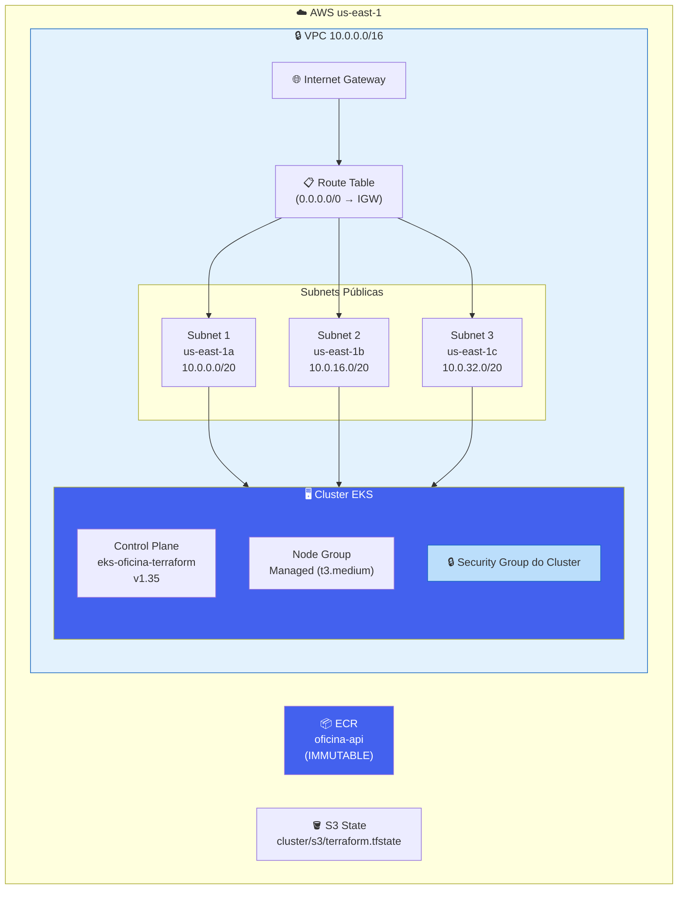

# 🏛️ Arquitetura — oficina-infra-cluster

Este repositório provisiona a camada base de rede e computação na AWS via Terraform.

## Recursos provisionados

## Outputs exportados

Estes valores são consumidos por outros repositórios via `terraform_remote_state`:

| Output | Descrição | Consumido por |
|---|---|---|
| `VPC_ID` | ID da VPC | `oficina-infra-database`, `oficina-auth-gateway` |
| `SUBNET_ID` | IDs das 3 subnets públicas | `oficina-infra-database`, `oficina-auth-gateway` |
| `SUBNET_CIDR_Block` | CIDRs das subnets | — |
| `EKS_Cluster_Name` | `eks-oficina-terraform` | `oficina-app-api` (kubeconfig) |
| `EKS_Security_Group_Id` | SG do cluster | `oficina-infra-database` (RDS ingress) |
| `Repository_URL` | URL do ECR | `oficina-app-api` (push de imagem) |
| `Tags` | Tags padrão do projeto | `oficina-infra-database` |

## Dependências

- **Pré-requisito:** Bucket S3 criado manualmente para armazenar o `terraform.tfstate`.
- **Dependentes:** `oficina-infra-database` e `oficina-auth-gateway` leem os outputs deste repositório via remote state.
- **IAM:** Usa a role pré-existente `LabRole` do AWS Academy (ver `iam-role.tf` — data source, não resource).
